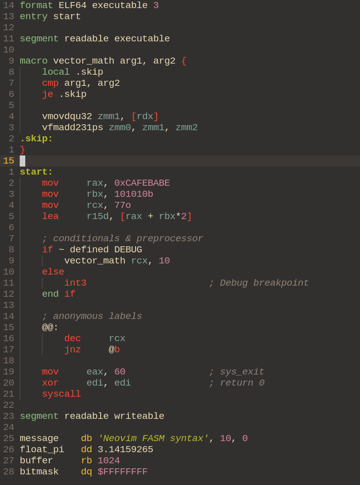

# fasm-syntax.nvim

A modern comprehensive syntax highlighting plugin for Flat Assembler (FASM) in Neovim.

Unlike older Vim scripts, this plugin is tailored for modern Neovim setups and provides extensive multi-architecture support out of the box, cleanly overriding Neovim's default assembler detection.

## Features

- **Multi-Architecture Support:**
  - **x86 / x86_64:** Standard instructions, Segments, FPU, SSE, AVX (up to `zmm`), Control/Debug registers.
  - **ARM / AArch64:** Standard registers, NEON/SVE vectors, and SIMD instructions.
  - **RISC-V:** Base registers, Vector/Floating-Point extensions, and instructions.
- **Smart Literal Detection:** Supports all FASM number formats (e.g., `0xFF`, `0FFh`, `$FF`, binary `1010b`, octal `77o`).
- **FASM Specifics:** Highlights directives, macros (`match`, `irp`, `rept`), conditionals, and anonymous labels (`@@:`).
- **Auto-Formatting:** Automatically sets up correct indentation, `tabstop`, and comment strings (`;`) for supported files.

## Installation & Configuration

The plugin is designed to work perfectly with **[lazy.nvim](https://github.com/folke/lazy.nvim)**.

Since Neovim has aggressive built-in detection for `.asm` and `.inc` files, this plugin uses specific pattern matching to ensure FASM syntax is applied correctly without conflicts.

### Using lazy.nvim

Add the following to your lazy configuration:

```lua
{
    "Berazold/fasm-syntax.nvim",
    name = "fasm-syntax",
    main = "fasm_syntax",
    opts = {
        extensions = { "fasm", "inc", "asm" },

        formatting = {
            tabstop = 8,
            softtabstop = 4,
            shiftwidth = 4,
            expandtab = true,
        },
    },
}

## Screenshots

### x86_64, AVX-512 & Macros


## License

[MIT](./LICENSE)
